# Peristaltic Loading for Pediatric Ureteral Stent Simulation

## Purpose and Scope
This document is an implementation-ready synthesis of:
- `/Users/akashc/masters/references/Improved Simulation Strategy for Pediatric Ureteral Stents in COMSOL.pdf`
- `/Users/akashc/masters/references/COMSOL Ureteral Stent Simulation Critique.pdf`

It reconciles parameter choices, separates physiology into explicit load cases, and defines a COMSOL workflow that is numerically stable and optimization-ready.


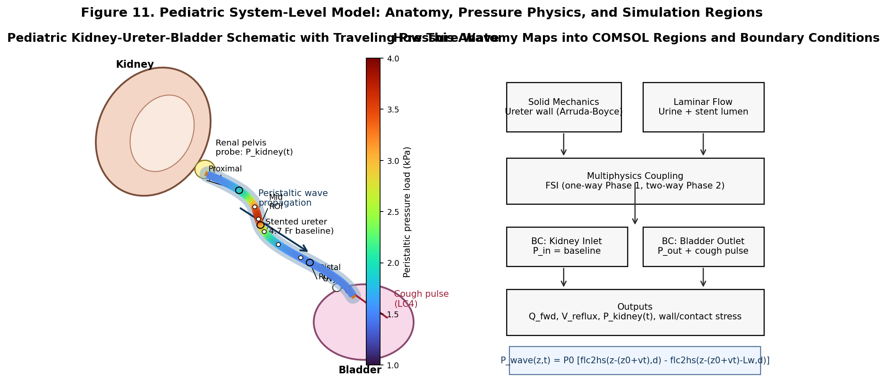

## Source Boundaries and Confidence
- High confidence: `flc2hs` implementation pattern, two-phase workflow, reflux-weighted objective framing, and boundary-case additions (cough, migration, encrustation).
- Medium confidence: absolute pediatric values where the PDFs rely on secondary literature (especially wall thickness and pressure baselines).
- Action: uncertain quantities are treated as sweep variables, not fixed constants.

## Reconciled Parameter Set (5-Year-Old Target Case)
Use this as the modeling contract. Values are selected from the two PDFs and converted into baseline + sweep form.

| Category | Parameter | Baseline | Stress Case / Alternate | Recommended Sweep |
|---|---|---:|---:|---:|
| Geometry | Ureter length `L_u` | 15 cm | 18 cm | 12-18 cm |
| Geometry | Ureter inner diameter `D_u` | 3.2 mm | 3.8 mm | 2.8-3.8 mm |
| Geometry | Ureter wall thickness `t_w` | 1.5 mm | 2.0 mm | 1.0-2.0 mm |
| Stent | Outer diameter `D_s` | 4.7 Fr (1.57 mm) | 6 Fr (2.00 mm) | 4-6 Fr |
| Stent | Length `L_s` | 15 cm | 16 cm | 12-18 cm |
| Stent | Side-hole diameter | 1.0 mm | 1.5 mm | 0.5-1.5 mm |
| Peristalsis | Wave speed `v` | 2.5 cm/s | 3.0 cm/s | 2-3 cm/s |
| Peristalsis | Wave length `L_w` | 5 cm | 6 cm | 5-6 cm |
| Peristalsis | Frequency `f` | 4 / min | 5 / min | 1-5 / min |
| Peristalsis | Peak pressure `P_wave` | 3.5 kPa | 6 kPa (spasm) | 3-6 kPa |
| Fluid | Density `rho` | 1000 kg/m^3 | - | fixed |
| Fluid | Viscosity `mu_f` | 0.001 Pa*s | 0.0013 Pa*s | 0.001-0.0013 |
| Material | Arruda-Boyce shear `mu0` | 0.17 MPa | 0.01-0.2 MPa sensitivity | 10-200 kPa sensitivity band |

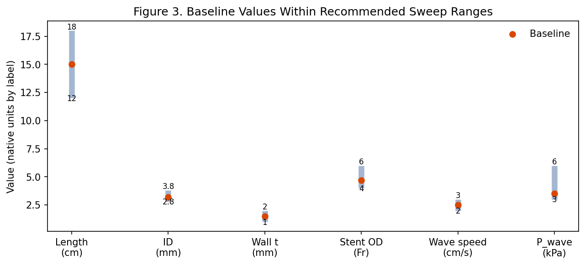

Notes:
- The prior draft mixed a low inlet pressure choice (`100 Pa`) with higher physiologic pelvis pressures. Keep these as separate scenarios, not one merged baseline.
- Wall thickness remains high-uncertainty and should not be locked to one value in optimization.

## Load-Case Matrix (Do Not Mix Cases)
Define separate studies for each case and compare designs across all cases.

| Case | Clinical Intent | Inlet BC (kidney side) | Outlet BC (bladder side) | Primary Metrics |
|---|---|---|---|---|
| LC1: Baseline drainage | Nominal function | Constant pressure (low) | 0 Pa reference | Forward flow `Q_fwd`, pressure drop `DeltaP` |
| LC2: Peristaltic transport | Wave-driven transport under stent | Same as LC1 | Same as LC1 | `Q_fwd(t)`, transient reflux fraction |
| LC3: Spasm episode | High contraction severity | Same as LC1 | Same as LC1 | Occlusion risk, peak wall stress |
| LC4: Cough/Valsalva pulse | Reflux safety worst-case | Same as LC1 | Gaussian pressure pulse at outlet, peak ~10 kPa, width ~0.05 s | Retrograde volume `V_reflux`, peak renal-side pressure |
| LC5: Encrustation progression | Robustness over time | Same as LC1 | Same as LC1 | Drainage retention at 25/50/75% hole occlusion |
| LC6: Migration mechanics | Mechanical retention | Structural model | Axial displacement or inertial load | Pull-out force, coil stress/contact |

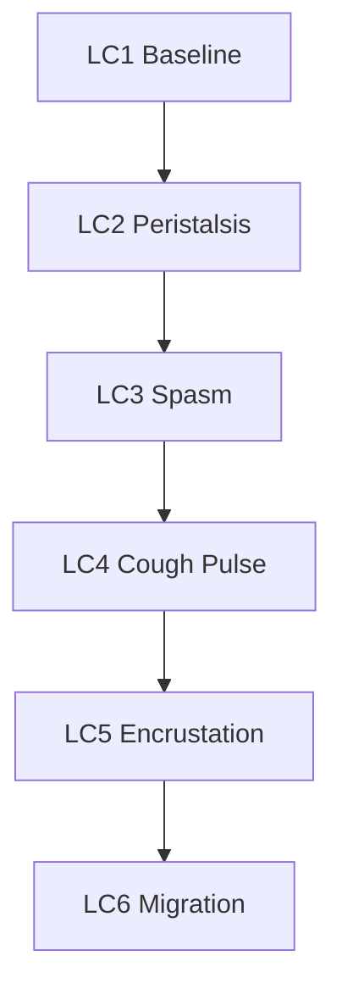

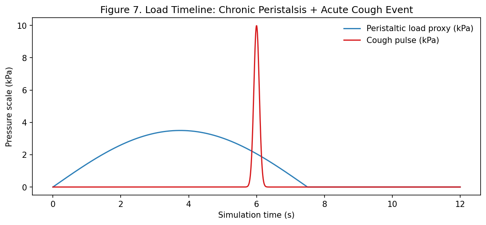
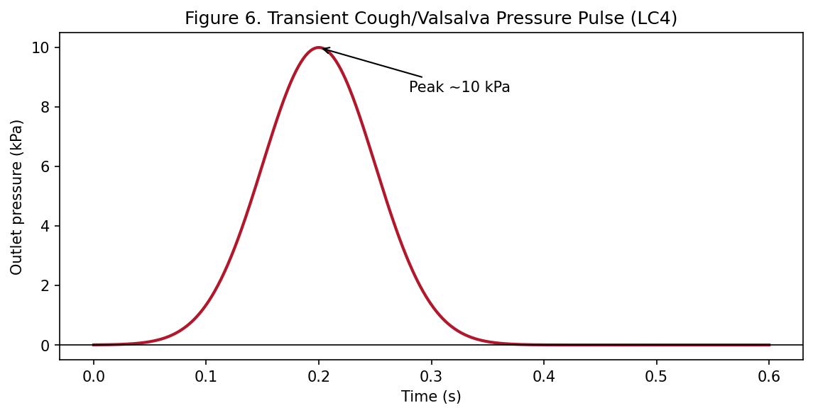

## COMSOL Implementation Blueprint

### 1. Geometry and Domains
- Start with straight ureter tube for screening; add curvature only in final validation if required.
- Include stent lumen + annular gap; keep side holes explicit in Phase 2.
- Represent pigtail coils in Phase 2 structural/contact model.

### 2. Peristaltic Wave with `flc2hs`
Use a moving top-hat pressure field:

```text
P_wave(z,t) = P0 * [flc2hs(z - (z0 + v*t), d) - flc2hs(z - (z0 + v*t) - Lw, d)]
```

Recommended starter values:
- `P0 = 3500 Pa` for nominal peristalsis
- `P0 = 6000 Pa` for spasm case
- `v = 0.025 m/s`
- `Lw = 0.05 m`
- `d = 0.002-0.003 m` (must satisfy mesh rule below)

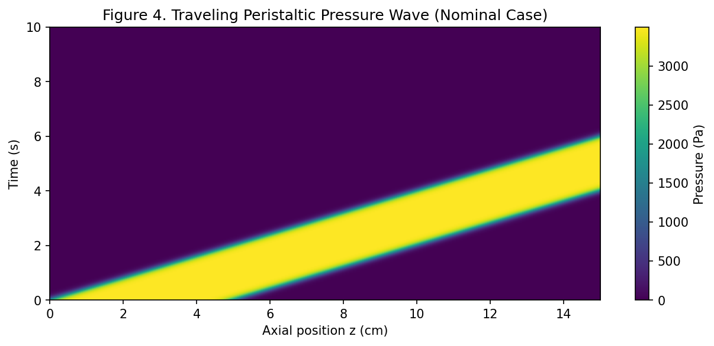
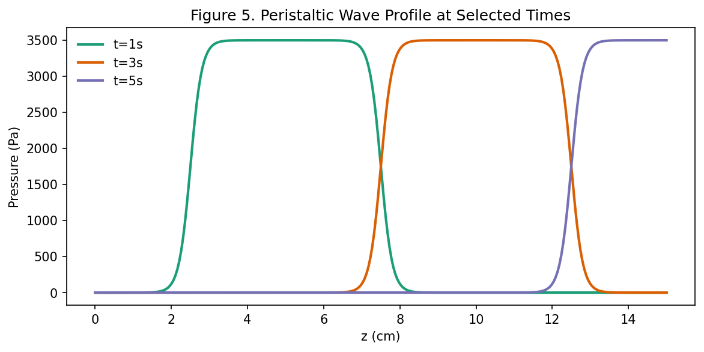

### 3. Numerical Guardrails (Mandatory)
- Smoothing-to-mesh rule: resolve transition width with at least 2-3 elements.
  - Practical check: `d >= 2*h_mesh` (preferred `d >= 3*h_mesh` near wave front).
- ALE inversion prevention for strong contraction:
  - enforce minimum-gap/contact regularization,
  - or avoid full closure in moving mesh,
  - or use one-way strategy for screening.
- Time stepping:
  - cap max step to resolve wave motion and pulse transients,
  - ensure adequate points across one peristaltic cycle and cough pulse.

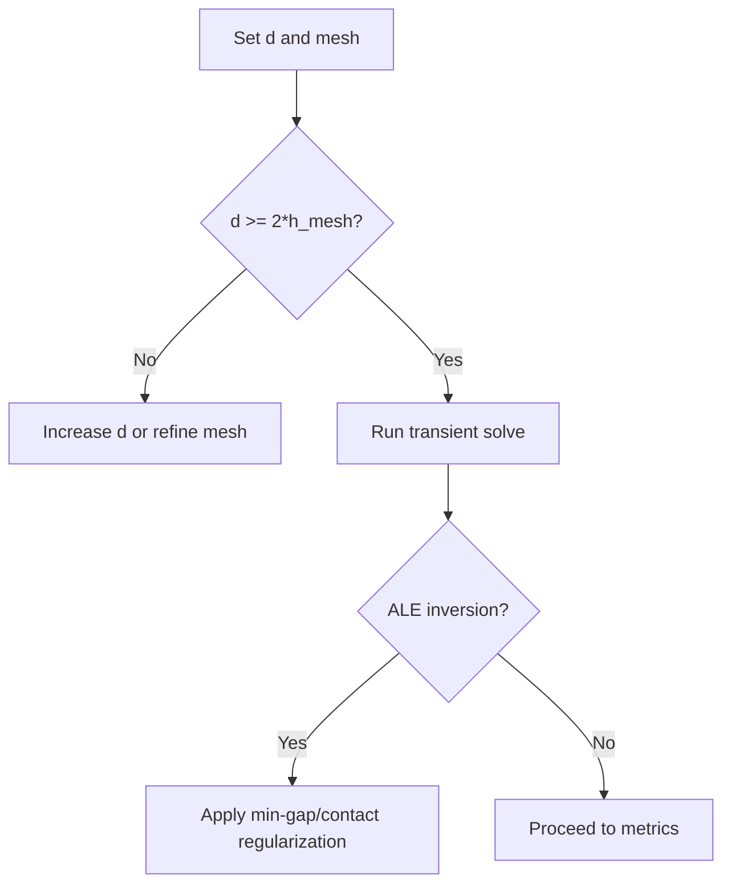

### 4. Phase 1 (High-Throughput Screening)
Configuration:
- Axisymmetric or simplified 3D.
- One-way coupling (solid deformation -> fluid solve).
- Rigid stent acceptable for first-order screening.
- Quasi-static compression snapshots or low-cost transient.

Outputs per design:
- `Q_fwd`, `DeltaP`, side-hole contribution, occlusion ratio, WSS map.
- Cough-case `V_reflux` proxy if feasible.

Sampling/optimization:
- LHS initial DOE.
- GP surrogate + Bayesian acquisition (expected improvement).
- Keep uncertain anatomy/material terms as random or swept inputs.

### 5. Phase 2 (High-Fidelity Validation)
Configuration:
- Full 3D transient FSI with ALE.
- Arruda-Boyce ureter wall with near-incompressible formulation.
- Contact between ureter and stent where required.
- Explicit cough pulse study in addition to peristaltic cycle.

Outputs:
- `Q(t)`, `P(t)` at kidney and bladder ends, `V_reflux`, contact force/stress maps, coil retention indicators.

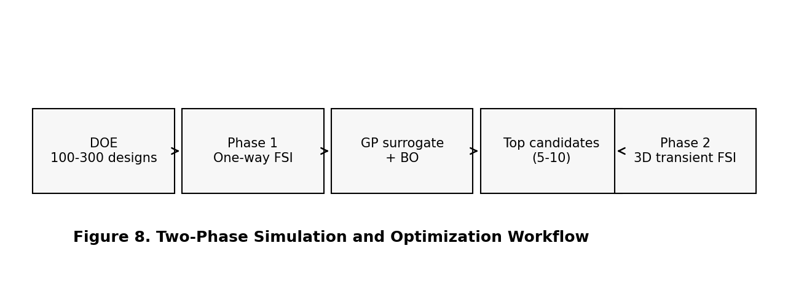

## Objective Function and Ranking
A drainage-only target is insufficient. Use a safety-weighted objective:

```text
J(x) = -w1*Q_fwd + w2*V_reflux + w3*sigma_trigone
```

Where:
- `Q_fwd`: antegrade drainage (maximize)
- `V_reflux`: retrograde volume under cough case (minimize)
- `sigma_trigone`: peak stress/contact proxy for irritation (minimize)

Clinical weighting guidance:
- prioritize `w2` (safety) over `w1` (drainage) in pediatric context.

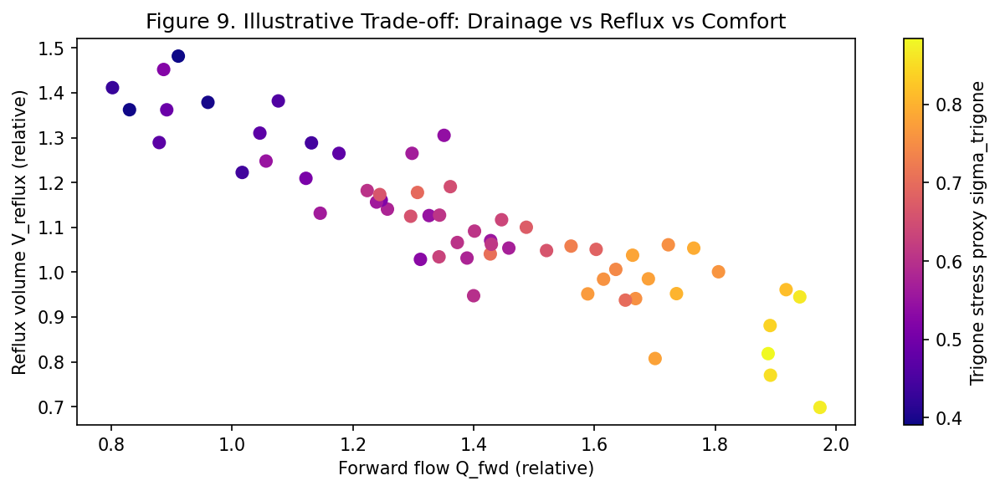

## Failure Modes and Robustness Figures

### Encrustation Robustness (LC5)
Progressive side-hole occlusion should be treated as dynamic boundary degradation, not a binary event.

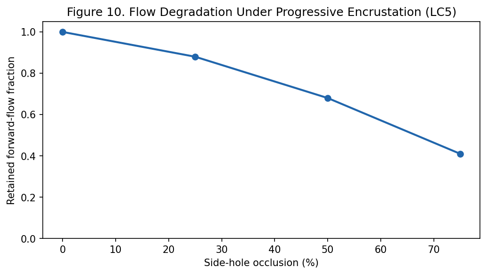

### Migration Resistance (LC6)
Evaluate retention mechanics via pull-out or inertial loading cases; compare stiffness-retention-irritation trade-offs.

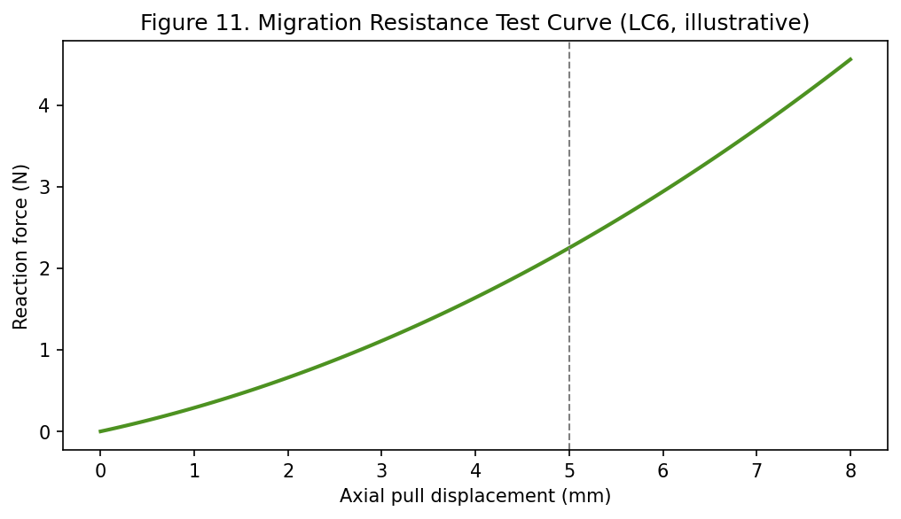

## Reynolds Sanity Check
Given pediatric diameters and expected flows, the regime remains laminar over the practical range.

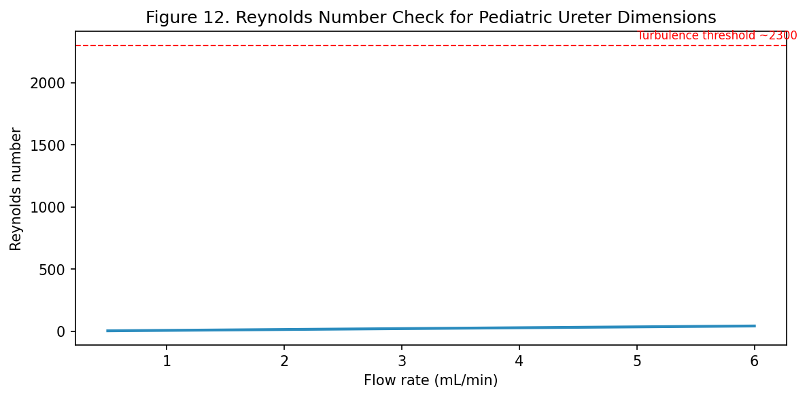

## Verification and Acceptance Checklist
A candidate design should pass all checks:

1. Numerical stability
- Converges without solver chattering across all load cases.
- Mesh/time refinement changes KPIs by <=5%.

2. Drainage performance
- Maintains acceptable `Q_fwd` in baseline and peristalsis.

3. Reflux safety
- Keeps `V_reflux` and renal-side peak pressure bounded during cough pulse.

4. Robustness to occlusion
- Retains acceptable flow with at least 50% side-hole occlusion.

5. Mechanical retention
- Meets pull-out force and coil stress criteria.


## Known Gaps and Mitigations
- Pediatric ureter constitutive data are sparse.
  - Mitigation: keep Arruda-Boyce for optimization, run broad `mu0` sensitivity, reserve HGO for focused trauma analysis only if justified.
- Some physiology values are cross-sourced and not fully pediatric-specific.
  - Mitigation: report interval outcomes, not single-point claims.
- UVJ valve behavior is simplified with stent present.
  - Mitigation: explicitly include cough boundary pulse and reflux metrics in ranking.

## Primary References Used in This Document
- `/Users/akashc/masters/references/Improved Simulation Strategy for Pediatric Ureteral Stents in COMSOL.pdf`
- `/Users/akashc/masters/references/COMSOL Ureteral Stent Simulation Critique.pdf`

Secondary studies discussed within those PDFs (for direct verification if needed):
- Palmer & Palmer (2007)
- Vahidi & Fatouraee (2012)
- Bevan et al. (2012)
- Shashi et al. (2022)
- Roshani et al. (2002)
- Robben et al. (1999)
- Zuluaga et al. (2013)
- Ribeiro et al. (2021)
