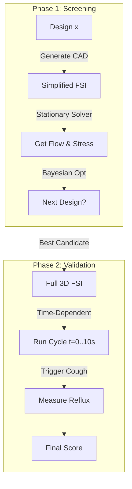

# Peristaltic Loading for Stent Simulation: Verified Analysis

> [!NOTE]
> This document synthesizes three sources: (1) my independent literature verification, (2) the "Improved Simulation Strategy for Pediatric Ureteral Stents in COMSOL" proposal, and (3) the "Critical Review and Methodology Enhancement" critique of that proposal. All parameters are cross-referenced.

---

## 1. Verified Parameter Table (5-Year-Old)

Three sources provide parameter values. Where they disagree, I note the recommended value for simulation.

| Parameter | Gemini Codex | Proposal Doc | Critique Doc | Verified (Literature) | **COMSOL Value** |
|---|---|---|---|---|---|
| Ureter length | 15 cm | 15–18 cm | Sweep 12–18 cm | Age+10 = 15 cm (Palmer 2007, r=0.88) | **Sweep 12–18 cm** |
| Internal diameter | 3 mm (R=1.5mm) | 3–4 mm | 3.2 ± 0.3 mm (Shashi 2022, MRU) | 3–5 mm range; avg ~3.8 mm widest | **Sweep 2.8–3.8 mm** |
| Wall thickness | 0.8 mm | ~1 mm (scaled from adult) | 1.6 mm mean (Robben 1999, range 0.8–3.1) | Not well characterized in peds | **Baseline 1.5 mm; check 2.0 mm** |
| Wave speed | 25 mm/s | 2–3 cm/s | 2–3 cm/s (verified) | 2–6 cm/s (Vahidi 2012) | **Fixed 2.5 cm/s** |
| Wave frequency | 4/min | 1–5/min | — | 2–6/min (variable, flow-dependent) | **4/min baseline** |
| Wave length | — | 5–6 cm | — | 3–12 cm (Vahidi); ~5 cm typical | **5 cm** |
| Peak peristaltic pressure | 3000 Pa | 3.5 kPa (~35 cmH₂O) | Normal: 3 kPa; **Spasm: 6 kPa** | Baseline ~14 mmHg, peaks ~26 mmHg | **Normal: 3.5 kPa; Spasm: 6 kPa** |
| Baseline renal pelvis P | — | 10–15 cmH₂O | — | ~1–1.5 kPa | **100 Pa inlet** |
| Intra-abdominal pressure | 800 Pa | — | **10–15 kPa during cough** | Healthy child: ~0 mmHg; cough spike to 100-150 cmH₂O | **0 Pa baseline; 10 kPa cough pulse** |
| Stent OD | 1.32 mm (4 Fr) | 1.57 mm (4.7 Fr) | — | 4.7 Fr standard pediatric | **Sweep 4–6 Fr (1.33–2.00 mm)** |
| Stent length | — | 14–16 cm | Sweep 12–18 cm | Age+10 guideline | **Sweep 12–18 cm** |
| Urine density | 1000 kg/m³ | ~1000 kg/m³ | — | Confirmed | **1000 kg/m³** |
| Urine viscosity | 1.3 cP | ~1 cP (0.001 Pa·s) | — | 0.65–1.3 cP range | **0.001 Pa·s** |

### Key Corrections from Previous Version

> [!WARNING]
> **`P_abd` was grossly wrong.** Previous version had 800 Pa (~6 mmHg) as a constant baseline. Reality: healthy child at rest = **~0 mmHg**. During coughing/straining, IAP spikes to **10–15 kPa** (100–150 cmH₂O) transiently. This is the "water hammer" effect that the Critique doc identifies as the **primary driver of reflux morbidity** in stented children.

> [!WARNING]
> **Stent size was wrong.** Previous version used 4 Fr (1.32 mm). The most commonly used pediatric stent is actually **4.7 Fr (1.57 mm)**. Simulation should sweep 4–6 Fr.

> [!IMPORTANT]
> **Wall thickness was underestimated.** Previous version used 0.8–1.0 mm. Robben et al. (1999) measured a mean of **1.6 mm** (range 0.8–3.1 mm) in pediatric collecting system walls. Since flexural stiffness scales as thickness³, this matters enormously for predicting stent compression.

> [!IMPORTANT]
> **All geometric parameters must be swept, not fixed.** The Critique correctly points out that a fixed-value simulation is fragile. The Palmer rule has r=0.88, so a 5-year-old could have a ureter from 13 to 17 cm. Sweeping captures this variance.

---

## 2. Visualizing the Simulation Environment (New)

> [!TIP]
> **"What does it look like?"**
> The simulation couples a traveling pressure wave (peristalsis) with a transient pressure spike (cough) acting on a standard pediatric stent geometry.

### A. The Geometry System
The domain consists of a **pigtail stent** sitting inside a **deformable ureter**.

```
                    KIDNEY (Inlet: P = 100 Pa)
                    ┌─────────────────────┐
                    │    ╭──── Pigtail ────╮   │
                    │    │   Coil (r=5mm)  │   │
     Ureter Wall    │    ╰────────────────╯   │    Ureter Wall
    (Arruda-Boyce)  │                          │   (Arruda-Boyce)
    ┃               │    ┃  Stent Body   ┃    │              ┃
    ┃  ← 1.5mm →    │    ┃  OD = 1.57mm  ┃    │  ← 1.5mm →  ┃
    ┃   wall         │    ┃  (4.7 Fr)     ┃    │   wall       ┃
    ┃               │    ┃    ○ side hole  ┃    │              ┃
    ┃               │    ┃               ┃    │              ┃
    ┃   ID = 3.2mm  │    ┃    ○ side hole  ┃    │              ┃
    ┃  ←──────────→ │    ┃               ┃    │              ┃
    ┃               │    ┃    ○ side hole  ┃    │              ┃
    ┃               │    ┃               ┃    │              ┃
    ┃               │    ┃    ○ side hole  ┃    │              ┃
    ┃               │    ╭────────────────╮   │              ┃
                    │    │   Pigtail Coil  │   │
                    │    ╰────────────────╯   │
                    └─────────────────────┘
                    BLADDER (Outlet: P = 0 Pa)
                    ⚠ Cough spike → 10 kPa!
```

**Key dimensions** (5-year-old):
- Ureter length: **12–18 cm** (sweep)
- Inner diameter: **3.2 ± 0.3 mm**
- Wall thickness: **~1.5 mm** (Robben 1999)
- Stent OD: **4.7 Fr** (1.57 mm) — fits inside the lumen with annular gap

### B. The Peristaltic Wave (`flc2hs`)
This is the "squeezing" function. A smoothed Heaviside "top-hat" pulse travels down the ureter.

```
  Pressure
  (Pa)
  3500 ┤          ┌──────────────────┐
       │         ╱                    ╲         ← Peak: 3.5 kPa (normal)
  3000 ┤        ╱                      ╲            or 6.0 kPa (spasm)
       │       ╱                        ╲
  2000 ┤      ╱                          ╲
       │     ╱                            ╲
  1000 ┤    ╱                              ╲
       │   ╱                                ╲
     0 ┤──╱──────────────────────────────────╲──────────────
       └──┬──┬──┬──┬──┬──┬──┬──┬──┬──┬──┬──┬──┬──┬──┬──→ z (cm)
          0  1  2  3  4  5  6  7  8  9  10 11 12 13 14 15

                    ├── 5 cm wave ──┤
                    ─────────────────→ traveling at 2.5 cm/s
```

**COMSOL expression:**
```
P_wave(z,t) = P0 * ( flc2hs(z - (z0 + v*t), d) - flc2hs(z - (z0 + v*t) - Lw, d) )
```
- `P0` = 3500 Pa,  `v` = 0.025 m/s,  `Lw` = 0.05 m,  `d` = 0.003 m

### C. The "Water Hammer" (Cough Impulse)
This is the **critical failure mode**. A cough spike sends a pressure shockwave retrograde up the stent.

```
  Pressure
  (kPa)
    10 ┤          ╱╲
       │         ╱  ╲         ← Peak: 10 kPa in ~100 ms
     8 ┤        ╱    ╲            (= 100 cmH₂O!)
       │       ╱      ╲
     6 ┤      ╱        ╲
       │     ╱          ╲
     4 ┤    ╱            ╲       ⚠ This drives REFLUX
       │   ╱              ╲        through the stent
     2 ┤  ╱                ╲       back to the kidney
       │ ╱                  ╲
     0 ┤╱────────────────────╲─────────────────────────
       └──┬──┬──┬──┬──┬──┬──┬──┬──┬──┬──┬──┬──┬──→ t (s)
        0.0  0.05 0.1 0.15 0.2 0.25 0.3 0.35 0.4 0.5
```

**COMSOL expression:**
```
P_cough(t) = P_peak * exp(-((t - t0)^2) / (2*sigma^2))
```
- `P_peak` = 10000 Pa,  `t0` = 0.2 s,  `sigma` = 0.05 s

### D. The Simulation Loop


---

## 3. Material Model: Arruda-Boyce


Both documents agree: **Arruda-Boyce is the right choice for Phase 1 optimization.**

### COMSOL Parameters

| Parameter | Value | Notes |
|---|---|---|
| Initial shear modulus μ₀ | **0.17 MPa** | From Bevan et al. (2012), corresponds to E ≈ 0.5 MPa at small strain |
| Chain extensibility N | **~5** | Generic biological tissue default; adjust to match ureter compliance |
| Poisson's ratio | **0.495** | Nearly incompressible (use mixed u-p formulation) |
| Bulk modulus | **2–5 GPa** | Enforces incompressibility numerically |

### Sensitivity Studies Required

The Critique recommends sweeping the shear modulus across **10–200 kPa** to bound behavior for both "floppy" and "stiff" ureters. This is important because:
- Pediatric tissue has near 1:1 smooth muscle:connective tissue ratio → more passive stiffness
- No direct pediatric ureter tissue data exists (ethical restrictions)
- The optimal stent design should be robust across the uncertainty range

### Phase 2: Consider HGO

For high-fidelity trauma analysis (Phase 2 only), the Holzapfel-Gasser-Ogden (HGO) model captures the **anisotropy** of the ureteral wall (helical collagen fibers). However, it requires 5–9 parameters that are nearly impossible to obtain for pediatric tissue. The Critique recommends:
- **Phase 1**: Arruda-Boyce (stable, 2 parameters, sufficient for flow optimization)
- **Phase 2**: HGO only if predicting tissue trauma/pain at stent contact points

---

## 3. Peristaltic Wave Implementation

### The `flc2hs` Approach (Both Documents Agree)

The smoothed Heaviside "top-hat" traveling pulse is the correct COMSOL implementation:

```
P_wave(z,t) = P0 * ( flc2hs(z - (z0 + v*t), d) - flc2hs(z - (z0 + v*t) - Lw, d) )
```

where:
- `P0` = peak pressure (3.5 kPa normal, 6 kPa spasm)
- `v` = wave speed (2.5 cm/s)
- `Lw` = wave length (5 cm)
- `d` = ε/2 = smoothing half-width (~2–3 mm)
- `z0` = wave starting position

### Critical Numerical Constraint

> [!CAUTION]
> **The smoothing scale `d` MUST be larger than 2× the mesh element size.** If `d < h_mesh`, the load jumps from 0 to max inside a single element. The shape functions cannot resolve this sub-grid curvature → solver failure or ringing artifacts. Rule: **d ≥ 2–3 × h_mesh**.

### Physical Justification

The Proposal doc notes this is physically reasonable — real muscle activation ramps over tens to hundreds of milliseconds, so abrupt step functions are unphysiological anyway. The `flc2hs` function provides C² continuity (two continuous derivatives) which the Newton-Raphson solver needs for convergence.

Define this under: **Definitions > Analytic Functions** in COMSOL, then reference in boundary load expressions.

---

## 4. Boundary Cases (From the Critique — Previously Missing)

### BC 1: Transient Reflux During Coughing ("Water Hammer")

**This is the most important missing physics.** A stent props the ureterovesical junction open. During a cough, IAP spikes to 10–15 kPa within milliseconds. Because the pediatric ureter is short (15 cm vs 30 cm adult), the pressure wave reaches the kidney faster.

**Implementation:**
- Separate time-dependent study step from peristaltic cycle
- At bladder outlet: impose a Gaussian pressure pulse:
  ```
  P_cough(t) = P_peak * exp(-((t - t0)² / (2*σ²)))
  ```
  where `P_peak` = 10 kPa, `σ` = 0.05 s (100 ms duration)
- **Metrics**: Peak pressure at renal pelvis; net retrograde volume

> [!IMPORTANT]
> A simulation that only models peristaltic drainage will favor large-lumen, many-hole stents (low resistance). But those same features make the stent a conduit for high-pressure reflux. The optimization must **penalize reflux**.

### BC 2: Stent Migration ("Jack-knifing")

Migration rates in children: **2.8–41%** depending on cohort. The current model treats the stent as fixed.

**Implementation:**
- Structural mechanics study
- Apply prescribed axial displacement or inertial body load (`a = 3g`)
- **Metric**: Pull-out force required to uncoil pigtail
- **Design conflict**: Stiffer coil resists migration but increases bladder irritation → Pareto optimization

### BC 3: Encrustation as Dynamic Boundary

Encrustation is progressive, not binary. Biofilms form in regions of low wall shear stress.

**Implementation:**
- Sequentially block side holes (25%, 50%, 75%) based on WSS maps from "clean" simulation
- **Metric**: Does the stent still provide adequate drainage at 50% occlusion?
- A design relying on many micro-features that easily foul is inferior to a simpler, robust design

---

## 5. Updated Objective Function

The previous objective (maximize flow, minimize pressure drop) is **insufficient**. The Critique proposes:

```
J(x) = -w₁·Q_forward + w₂·V_reflux + w₃·σ_trigone
```

where:
- **Q_forward** = antegrade drainage flow rate (maximize → minimize negative)
- **V_reflux** = retrograde volume during cough simulation (minimize)
- **σ_trigone** = peak von Mises stress on bladder trigone (minimize)
- **w₁, w₂, w₃** = weights; clinical priority: **Safety > Drainage > Comfort**

This replaces the simple `maximize flow + minimize pressure` scalarization.

---

## 6. Two-Phase Workflow (Confirmed by Both Documents)

### Phase 1: Surrogate-Assisted Screening

| Aspect | Specification |
|---|---|
| Physics | Simplified FSI: axisymmetric or static 3D, one-way coupled |
| Peristalsis | Static or quasi-static pressure load at peak contraction |
| Stent | Rigid (acceptable first-order assumption — polymer stent is much stiffer than ureter) |
| Material | Can use simplified hyperelastic or even linear elastic (tuned to approximate) |
| Runtime | Minutes per design, enables 100s of evaluations |
| Outputs | Q_out, ΔP, Q_side, % lumen occlusion, wall shear stress |
| Optimization | LHS initial sampling → GPR surrogate → Bayesian optimization (EI acquisition) |

### Phase 2: High-Fidelity FSI Validation

| Aspect | Specification |
|---|---|
| Physics | Full 3D FSI: two-way coupled, ALE moving mesh, transient |
| Geometry | Full stent (with pigtails, side holes) inside deformable ureter tube |
| Material | Arruda-Boyce ureter (μ₀=0.17 MPa, ν=0.495); stent as linear elastic polyurethane (E~200-300 MPa) |
| Peristalsis | Time-dependent traveling `flc2hs` wave, full cycle (~5-10 s real time) |
| Contact | Ureter-stent contact pairs (penalty or augmented Lagrangian, frictionless) |
| Inlet BC | Constant 100 Pa (baseline pelvic pressure) |
| Outlet BC | 0 Pa (atmospheric) |
| Add. study | Transient cough pulse (10 kPa, 100 ms) at outlet |
| Runtime | Hours per design, only top 5 candidates |
| Outputs | Time-dependent Q(t), peak intraluminal P, contact forces, reflux volume, wall stress maps |

### ALE Pitfall

> [!CAUTION]
> **"Inverted Mesh Element" crash**: When peristaltic contraction squeezes the lumen to zero, the ALE fluid domain volume becomes zero/negative → singular Jacobian. **Solution**: Implement a minimum gap constraint or penalty contact. Walls must stop squeezing at ~50 μm separation. Alternatively, use one-way coupled approach for Phase 1 (no mesh inversion risk).

---

## 7. FSI Coupling Decision

The Critique provides a clear argument for one-way coupling in Phase 1:

| | Two-Way (Fully Coupled) | One-Way (Phase 1) |
|---|---|---|
| Physics | Fluid pressure deforms wall; wall deformation alters flow | Solve solid first → apply wall deformation to fluid |
| Cost | Hours/days per run | Minutes per run |
| Valid when | Fluid pressure comparable to wall forces (e.g., arterial flow) | Muscle contraction force (kPa) >> fluid inertial forces |
| Ureter context | Peristaltic force dominates; fluid added-mass negligible | **Valid** — urine density/velocity are low |

**Conclusion**: One-way coupling is physically justified for the ureter and should be used for all Phase 1 screening.

---

## 8. Reynolds Number Check

The Proposal doc provides a useful sanity check:
- Diameter: 3 mm
- Flow: 2 mL/min
- **Re ≈ 50–100** → firmly laminar

This justifies using laminar Navier-Stokes with no turbulence modeling.

---

## 9. Stent Design Space

| Parameter | Range | Source |
|---|---|---|
| Outer diameter | 4–6 Fr (1.33–2.00 mm) | Pediatric clinical practice |
| Length | 12–18 cm | Age+10 ± variance |
| Side holes per segment | 0–10 | Design exploration |
| Side hole diameter | 0.5–1.5 mm | Manufacturer specs (Cook®) |
| Pigtail coil radius | 5–10 mm | Clinical stent geometry |
| Material stiffness (sensitivity) | 200–300 MPa (polyurethane) | Ancillary study |

---

## 10. Primary Sources

| Source | Key Contribution |
|---|---|
| Vahidi & Fatouraee, J Theor Biol (2012) | FSI model, Arruda-Boyce coefficients, wave speed 2 cm/s, rigid contact method |
| Bevan et al., Am J Biomed Sci (2012) | Stented ureter simulation, μ₀≈0.17 MPa, found reflux with peristalsis+stent |
| Palmer & Palmer, J Urol (2007) | Age+10 stent length rule, r=0.88, n=153 |
| Shashi et al., Ped Radiol (2022) | MRU-based normative ureter diameter: 3.2±0.3 mm at age 5-6 |
| Robben et al. (1999) | Pediatric collecting system wall thickness: mean 1.6 mm (range 0.8-3.1) |
| Roshani et al., Urology (2002) | Pig ureter in-vivo manometry: ~35 cmH₂O peak pressure |
| Yin & Fung, Am J Physiol (1971) | Experimental ureteral wall stress-strain curves |
| COMSOL Peristaltic Pump example | flc2hs usage template for traveling wave |
| Ribeiro et al. (2021) | Surrogate-based multi-objective coronary stent optimization precedent |
| Zuluaga et al., ICML (2013) | Active learning for multi-objective (ε-PAL algorithm) |
